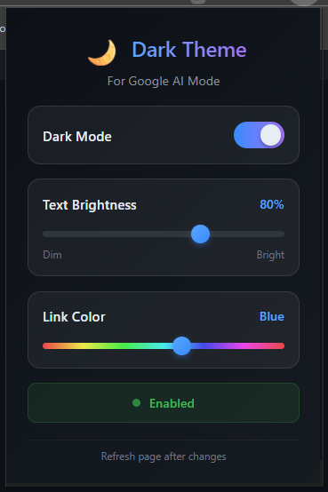

<div align="center">

# 🌙 Google AI Dark Theme

**A premium Chrome extension that applies a sleek dark theme to Google Search AI Mode.**

[](https://github.com/Dark417/google-ai-dark-theme)
[](https://developer.chrome.com/docs/extensions/mv3/)
[](LICENSE)

<br>



<br>

</div>

---

## ✨ Features

<table>
<tr>
<td>🎨</td>
<td><b>Premium Dark Theme</b></td>
<td>Deep dark backgrounds with balanced contrast</td>
</tr>
<tr>
<td>🤖</td>
<td><b>AI Mode Optimized</b></td>
<td>Styled for Google's AI responses and conversation UI</td>
</tr>
<tr>
<td>🔆</td>
<td><b>Adjustable Brightness</b></td>
<td>Slider to set text brightness (40% - 100%)</td>
</tr>
<tr>
<td>🌈</td>
<td><b>Custom Link Colors</b></td>
<td>Pick any color for links via hue slider</td>
</tr>
<tr>
<td>💾</td>
<td><b>Persistent Settings</b></td>
<td>Preferences saved across sessions</td>
</tr>
</table>

---

## 🚀 Installation

```bash
git clone https://github.com/Dark417/google-ai-dark-theme.git
```

1. Open Chrome → `chrome://extensions/`
2. Enable **Developer Mode** (top-right)
3. Click **Load unpacked** → Select the cloned folder
4. Click the 🌙 icon in your toolbar to configure

---

<div align="center">

## 📝 License

MIT License - see [LICENSE](LICENSE) for details.

<br>

## 🙏 Acknowledgments

Inspired by GitHub's dark theme color palette

<br>

## 📧 Contact

**GitHub**: [@Dark417](https://github.com/Dark417)

---

<br>

*Made with 🌙 for night owls*

</div>
